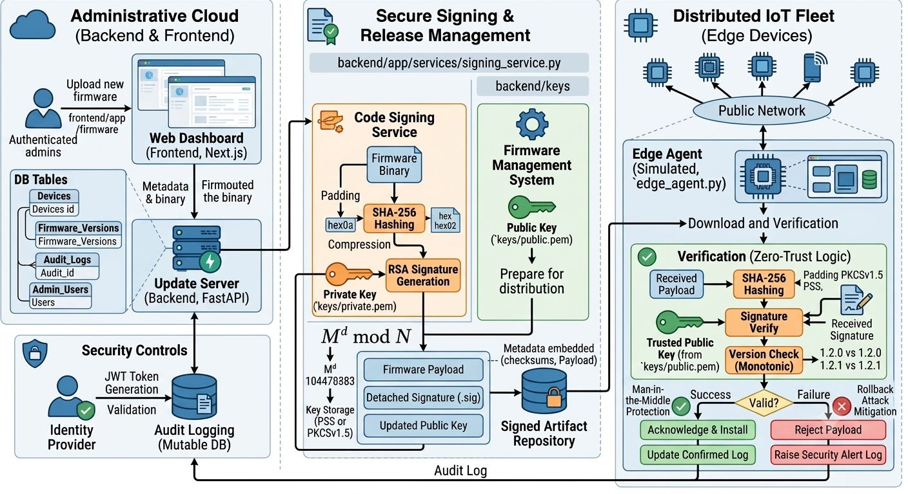

# secure-ota-firmware-system
Logistics & IoT Edge — Secure OTA Firmware Update & Code Signing


## 📌 Overview
This repository implements a secure, zero-trust Over-The-Air (OTA) firmware update system for distributed IoT fleets. It includes a FastAPI backend that signs firmware payloads and an administrative Next.js frontend for managing devices, firmware releases, and audit logs.

Key goals:
- Protect firmware integrity with SHA-256 hashing and asymmetric signatures.
- Provide authenticated administrative workflows for firmware release and device management.
- Maintain immutable audit trails for all security-sensitive actions.

---

## 🧩 Features (MVP)

- Cryptographic signing pipeline (`signing_service`) that computes SHA-256 fingerprints and produces signatures using the keys in the `keys/` folder.
- FastAPI backend with modular `routers/` for authentication, device registration, firmware ingestion, and auditing.
- Next.js administrative UI (in the `frontend` folder) to upload firmware, view devices, and inspect audit logs.

---

## 🚀 Quick start

Prerequisites:
- Python 3.10+ (backend)
- Node.js 18+ and npm (frontend)

Start backend (from repo root):

```bash
python -m venv .venv
source .venv/bin/activate
pip install -r requirements.txt
uvicorn backend.app.main:app --reload --host 0.0.0.0 --port 8001
```

Start frontend (from `frontend`):

```bash
cd frontend
npm install
npm run dev
```

If you want to override the backend URL, set `NEXT_PUBLIC_BACKEND_URL` to your backend host before starting the frontend.

Notes:
- Keep the private key in `keys/private.pem` secret; do not commit changes to it.
- The backend uses a local SQLite file for development.

---

## 🔒 New security additions

This update adds explicit security documentation and clarifies the current secure OTA file layout.

- Added a dedicated security section describing firmware signing, verification, and key handling.
- Documented the edge agent verification path and trust model.
- Updated the repo tree to match the actual project structure.
- Included current backend and frontend key artifact locations.

---

## 📂 Repository layout

This project is organized into three main areas: the FastAPI backend, the Next.js admin frontend, and the shared security/firmware assets. The tree below includes the core source files and omits local build folders such as .venv, node_modules, .next, and Python cache directories for clarity.

```text
.
├── .github/
│   └── workflows/
│       └── ci-cd-signing.yml
├── backend/
│   ├── app/
│   │   ├── __init__.py
│   │   ├── config.py
│   │   ├── database.py
│   │   ├── main.py
│   │   ├── dependencies/
│   │   │   └── auth.py
│   │   ├── models/
│   │   │   ├── audit.py
│   │   │   ├── device.py
│   │   │   ├── firmware.py
│   │   │   └── user.py
│   │   ├── routers/
│   │   │   ├── auth.py
│   │   │   ├── dashboard.py
│   │   │   ├── device.py
│   │   │   ├── firmware.py
│   │   │   └── logs.py
│   │   ├── schemas/
│   │   │   ├── auth.py
│   │   │   ├── dashboard.py
│   │   │   └── device.py
│   │   ├── services/
│   │   │   ├── audit_service.py
│   │   │   ├── hash_service.py
│   │   │   ├── signing_service.py
│   │   │   ├── verify_signature.py
│   │   │   └── verify-signature.py
│   │   └── utils/
│   │       ├── __init__.py
│   │       ├── security.py
│   │       └── version.py
│   ├── firmware_storage/
│   │   ├── test_firmware.bin
│   │   └── test_firmware.bin.sig
│   ├── keys/
│   │   └── public.pem
│   ├── tests/
│   │   ├── test_security.py
│   │   ├── test_verify_signature.py
│   │   └── test_versioning.py
│   └── .env
├── edge_agent.py
├── firmware_storage/
│   ├── firmware.bin
│   ├── firmware.bin.sig
│   ├── test_firmware.bin
│   └── test_firmware.bin.sig
├── frontend/
│   ├── app/
│   │   ├── components/
│   │   │   ├── AppShell.tsx
│   │   │   ├── Navbar.tsx
│   │   │   └── ProtectedRoute.tsx
│   │   ├── dashboard/page.tsx
│   │   ├── devices/page.tsx
│   │   ├── firmware/page.tsx
│   │   ├── firmware/history/page.tsx
│   │   ├── hooks/useAuth.ts
│   │   ├── lib/api.ts
│   │   ├── login/page.tsx
│   │   ├── logs/page.tsx
│   │   ├── page.tsx
│   │   ├── register/page.tsx
│   │   ├── types/device.ts
│   │   ├── types/firmware.ts
│   │   ├── globals.css
│   │   ├── layout.tsx
│   │   └── page.tsx
│   ├── public/
│   ├── services/api.ts
│   ├── AGENTS.md
│   ├── CLAUDE.md
│   ├── README.md
│   ├── eslint.config.mjs
│   ├── next-env.d.ts
│   ├── next.config.ts
│   ├── package.json
│   ├── package-lock.json
│   ├── postcss.config.mjs
│   └── tsconfig.json
├── keys/
│   ├── private.pem
│   └── public.pem
├── .gitignore
├── LICENSE
├── README.md
├── requirements.txt
└── test_firmware.bin
```

### What each part does
- Backend: the FastAPI application that handles authentication, device and firmware data, signature verification, and audit logs.
- Frontend: the Next.js dashboard used to manage devices, firmware releases, and activity logs from the browser.
- Security assets: the cryptographic keys and signed firmware artifacts used by the backend and the edge agent.
- CI/CD: the workflow in [.github/workflows/ci-cd-signing.yml](.github/workflows/ci-cd-signing.yml) automates signing and release packaging.

---

## 🗓️ Four-week roadmap (high level)

Week 1 — PKI & signing
- Provision dev RSA/ECDSA key pair in `keys/` and harden key handling.
- Implement and test `hash_service` + `signing_service` workflows.

Week 2 — Data & API
- Finalize SQLAlchemy models and migrations.
- Harden authentication and token flows in `routers/auth.py`.

Week 3 — Frontend & integration
- Finish core Next.js UI flows: login, firmware upload, device list, audit view.
- Connect UI to backend endpoints and validate signature verification on downloads.

### 🔒 Week 4: Verification, UI Integration & Rollback Protections
*   Connect the frontend components with the backend API to showcase dynamic tracking metrics, signature statuses, and active log collections.
*   Introduce monotonic system version logic to ensure target edge devices cannot be forced to downgrade to older, vulnerable firmware packages.
### 🔒 Week 4 — Verification & hardening
- Add monotonic version checks and rollback protection.
- Add end-to-end tests and update documentation.

---

## Security & contributing notes

- Do not commit `keys/private.pem`. Use environment-backed secret stores for production.
- Follow secure key rotation and least-privilege practices when integrating with build pipelines.
- Keep `keys/public.pem` available to the edge agent or verification service.

---

## 🔐 Secure OTA signing workflow

This repository now includes the core MVP flow for secure firmware distribution:

1. A firmware artifact is generated and hashed.
2. The backend signs the artifact with an RSA private key through [backend/app/services/signing_service.py](backend/app/services/signing_service.py).
3. The resulting signature is stored alongside the firmware metadata.
4. A simulated edge agent downloads the payload, recomputes the SHA-256 hash, and verifies the signature with the public key before accepting installation.

### Threat model
- An attacker who tampers with the firmware binary will fail the hash check.
- An attacker who tampers with the signature will fail the cryptographic verification step.
- The device rejects unsigned or invalidly signed payloads and raises a critical security alert.

### CI/CD automation
- GitHub Actions is configured in [.github/workflows/ci-cd-signing.yml](.github/workflows/ci-cd-signing.yml).
- The workflow expects the private and public keys to be injected as GitHub Secrets named `PRIVATE_KEY` and `PUBLIC_KEY`.
- The workflow signs the artifact on tag-based releases and uploads the signed binary as an action artifact.

### Local verification example
```bash
python3 -m unittest discover -s backend/tests -p 'test_*.py'
python3 edge_agent.py --firmware-url file:///tmp/ota-demo/firmware.bin --signature-url file:///tmp/ota-demo/firmware.bin.sig --public-key keys/public.pem
```

### Key handling guidance
- Prefer environment-based injection for private keys in CI/CD.
- Never commit private key material to the repository.
- Keep the public key on the edge device or in the verification agent assets.

Thank you — contributions and issues are welcome.

