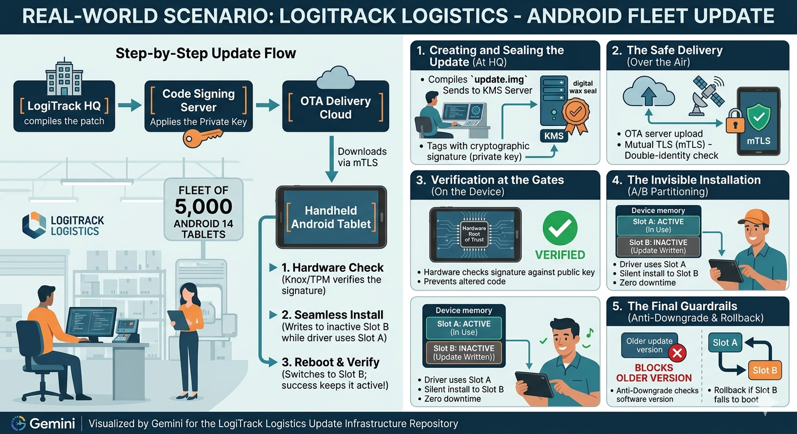

# secure-ota-firmware-systemLogistics & IoT Edge - Secure OTA Firmware Update & Code Signing Infrastructure

## 📌 Project Overview & Executive Problem StatementSupply chain and logistics companies rely heavily on distributed fleets of IoT tracking devices to monitor valuable cargo in transit. However, deploying software updates to these remote edge endpoints introduces a critical security vulnerability. If a malicious actor intercepts an Over-the-Air (OTA) update and pushes a compromised binary, they can commandeer the entire fleet. 

The objective of this project is to architect a highly secure, zero-trust OTA Firmware Update framework. This repository implements a CI/CD pipeline that autonomously signs firmware updates cryptographically, paired with a simulated edge-device client that rigorously verifies the firmware's integrity and signature before permitting installation.
### Business Objectives & KPIs*   **Zero-Trust Device Management:** Achieve a reliable, automated firmware distribution engine.*   **Source Verification & Integrity Assurance:** The edge system must instantly drop and reject any firmware payload where the hash has been altered or the digital signature fails to match the local public key.
---## 👥 Operational Workflows & Personas*   **IoT Embedded Developer:** Focuses on seamless, automated code signing without managing manual keys. They push code to GitHub; the CI/CD pipeline automatically signs the binary and uploads it to the secure distribution target.*   **Security Architect:** Mandates strict cryptographic validation and rollback preventions. They audit the edge logs to ensure verification checks pass and that outdated, vulnerable versions cannot be maliciously injected.
---## 🛠️ Minimum Viable Product (MVP) Specifications1.  **Cryptographic Signing Pipeline:** Orchestrated during the automated build pipeline. Asymmetric cryptographic keys are accessed securely via injected environment variables (never stored in plaintext) to generate a digital signature for the compiled binary.2.  **Edge Verification Agent:** A simulated client application written in Python or C. It downloads the update package, calculates the SHA-256 hash to detect transit manipulation, and mathematically validates the digital signature against its stored public key before initiating a mock reboot.
---## 🗓️ Four-Week Engineering Roadmap### 📦 Week 1: PKI Setup and Cryptographic Hashing*   Establish the baseline Public Key Infrastructure (PKI) using asymmetric pairs (RSA or ECDSA).
*   Write a standalone utility script that takes a dummy firmware binary file (`.bin`), calculates its local cryptographic hash, and signs it using the private key.
### 🚀 Week 2: CI/CD Automated Code Signing*   Integrate the signing workflow into an automated GitHub Actions pipeline.*   Configure the private signing keys to be stored securely as encrypted GitHub Secrets.*   Set up workflow execution rules that trigger on a new release tag, sign the binary, and upload it to a distribution endpoint (e.g., AWS S3 bucket).
### 🛡️ Week 3: Edge Device Verification Logic*   Build the simulated client-side IoT edge agent script.*   Program the client logic to download the signed payload, extract the metadata parameters, and mathematically verify the signature against the pre-provisioned local public key.*   Enforce security isolation: if verification fails, drop the payload entirely and log a critical security alert.
### 🔒 Week 4: Version Control and Rollback Mechanisms*   Introduce anti-rollback protections by combining monotonic timestamp rules and build iterations.*   Enforce checks to ensure attackers cannot force a device to downgrade to an older, vulnerable firmware patch.*   Thoroughly document the overall threat model, logical architecture layers, and mathematical primitives used.
---## 🔐 Threats & Engineering Mitigations Matrix
| Identified Threat | Security Mitigation Strategy | Implementation Target |
| :--- | :--- | :--- |
| **Firmware Tampering / MITM** | Pre-boot cryptographic validation using local public keys. | `/edge/` |
| **Key Compromise / Leakage** | Complete key isolation using GitHub Secrets. | `.github/workflows/` |
| **Malicious Downgrades** | Dynamic anti-rollback counter validation signed into metadata. | `/edge/` |
| **Payload Invalidation** | Enforced baseline validation using local SHA-256 fingerprint calculations. | `/scripts/` |
---## 📂 Repository Layout```text
├── .github/workflows/     # Week 2: GitHub Actions code signing and release pipelines
├── certificates/          # Week 1: Target public keys and root testing certificates
├── docs/                  # Week 4: Deep dive threat modeling and crypto specification sheets
├── edge/                  # Week 3: Client simulation agent, verification engine, and reboot hooks
├── scripts/               # Week 1: Hashing utilities and local signing scripts
└── tools/                 # Week 4: Testing utilities for simulating flawed or interrupted rollouts
```
---## 🚦 Infotact Mandatory Git & Verification Standards
To pass evaluation, the development workflow must strictly adhere to the following enterprise-grade protocols:
1.  **Continuous Git Contribution:** Compressed histories or massive monolithic pushes during the final week will result in immediate disqualification. Commits must be distributed evenly across all 4 weeks to show daily debugging and architectural effort.
2.  **Semantic, Present-Tense Commit Messaging:** Commits must use granular wrappers and semantic prefixes (e.g., `feat: integrate digital signature verification (fixes #3)` or `fix: resolve payload drop logic`).3.  **Kanban Project Board Mapping:** The 4-week roadmap must be tracked explicitly via GitHub Issues linked to your Projects tab. Every commit must reference the explicit issue ID it acts upon.
4.  **Strict Branching Isolation:** Commits straight to `main` or `master` are forbidden. All mechanics must be built out on separate feature branches and merged into production using detailed Pull Requests.5.  **Zero Key Leaks:** Hardcoding private keys, access tokens, or connection parameters inside files is grounds for immediate failure. Utilize secure Environment Variables and GitHub Secrets exclusively.
